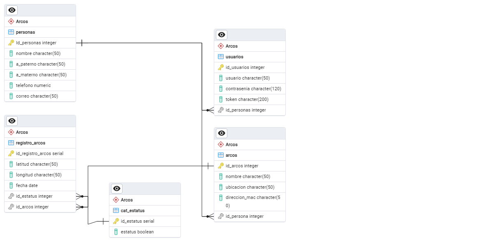

# Proyecto-PostgreSQL-Avanzado
Proyecto Arcos Carrreteros

Autor: Jose Manuel Barrientos Quintero

### Archivo de BACKUP de la base de datos.

[Descargar archivo de restauración](https://github.com/Juliodfconde/Curso_postgress/blob/main/backup/db_alertamientos26062024.sql)

### Descripción de la Base de Datos

La base de datos del sistema de Arcos Carreteros está diseñada para registrar y monitorear tanto los arcos carreteros instalados en las carreteras del territorio Mexicano como el monitoreo de su forma de operar,facilita el seguimiento de automoviles los cuales estan involucrados en algun acontesimiento delictivo mediante un sistema organizado de tablas y relaciones. como a continuación se describen:

1. *Tabla cat_estatus*: Contiene dos posibles datos hacerca de un estatus que se utilizara en alguna tabla.
2. *Tabla tbl_registro_arcos*: Contiene los registros de las lecturas que recolecta el arco carretero en su operacion.
3. *Tabla tbl_arcos*: Almacena los datos de los arcos carreteros, para poder tener control de ellos.
4. *Tabla tbl_personas*: Registra información sobre los elementos que podran usar el sistema.
5. *Tabla tbl_usuarios*: Administra los accesos de usuarios al sistema, almacenando nombres de usuarios y contraseñas.

### Relaciones

Las tablas están interconectadas mediante claves foráneas para mantener la integridad de los datos y facilitar la referencia cruzada entre diferentes tipos de información. Por ejemplo:

- La tabla cat_estatus referencia a tbl_registro_arcos para identificar los arcos activos o inactivos.
- La tabla tbl_arcos referencia a tbl_registro_arcos para identificar de que arco viene la informacion.
- La tabla tbl_personas referencia a tbl_arcos para identificar que persona esta registrada en el arco carrretero.
- La tabla tbl_personas referencia a tbl_usuarios para identificar que persona esta relacionada con el usuario que administra el sistema.

### Diagrama Entidad-Relación

### Código SQL para Generar la Base de Datos

BEGIN;

CREATE TABLE IF NOT EXISTS "Arcos".arcos
(
    id_arcos integer NOT NULL DEFAULT nextval('"Arcos".arcos_id_seq'::regclass),
    nombre character(50) COLLATE pg_catalog."default" NOT NULL,
    ubicacion character(50) COLLATE pg_catalog."default" NOT NULL,
    direccion_mac character(50) COLLATE pg_catalog."default" NOT NULL,
    id_persona integer NOT NULL,
    CONSTRAINT arcos_pkey PRIMARY KEY (id_arcos)
);

CREATE TABLE IF NOT EXISTS "Arcos".cat_estatus
(
    id_estatus serial NOT NULL,
    estatus boolean NOT NULL,
    CONSTRAINT cat_estatus_pkey PRIMARY KEY (id_estatus)
);

CREATE TABLE IF NOT EXISTS "Arcos".personas
(
    "Id_personas" integer NOT NULL DEFAULT nextval('"Arcos"."Personas_Id_seq"'::regclass),
    nombre character(50) COLLATE pg_catalog."default" NOT NULL,
    a_paterno character(50) COLLATE pg_catalog."default" NOT NULL,
    a_materno character(50) COLLATE pg_catalog."default" NOT NULL,
    telefono numeric NOT NULL,
    correo character(50) COLLATE pg_catalog."default" NOT NULL,
    CONSTRAINT "Personas_pkey" PRIMARY KEY ("Id_personas")
);

CREATE TABLE IF NOT EXISTS "Arcos".registro_arcos
(
    id_registro_arcos serial NOT NULL,
    latitud character(50) COLLATE pg_catalog."default" NOT NULL,
    longitud character(50) COLLATE pg_catalog."default" NOT NULL,
    fecha date NOT NULL,
    id_estatus integer NOT NULL,
    id_arcos integer NOT NULL,
    CONSTRAINT registro_arcos_pkey PRIMARY KEY (id_registro_arcos)
);

CREATE TABLE IF NOT EXISTS "Arcos".usuarios
(
    id_usuarios integer NOT NULL DEFAULT nextval('"Arcos".usuarios_id_seq'::regclass),
    usuario character(50) COLLATE pg_catalog."default" NOT NULL,
    contrasenia character(120) COLLATE pg_catalog."default" NOT NULL,
    token character(200) COLLATE pg_catalog."default" NOT NULL,
    id_personas integer NOT NULL,
    CONSTRAINT usuarios_pkey PRIMARY KEY (id_usuarios)
);

ALTER TABLE IF EXISTS "Arcos".arcos
    ADD CONSTRAINT id_fk_arcos_perosnas FOREIGN KEY (id_persona)
    REFERENCES "Arcos".personas ("Id_personas") MATCH SIMPLE
    ON UPDATE NO ACTION
    ON DELETE NO ACTION
    NOT VALID;

ALTER TABLE IF EXISTS "Arcos".registro_arcos
    ADD CONSTRAINT id_fk_registro_arcos_arcos FOREIGN KEY (id_arcos)
    REFERENCES "Arcos".arcos (id_arcos) MATCH SIMPLE
    ON UPDATE NO ACTION
    ON DELETE NO ACTION
    NOT VALID;

ALTER TABLE IF EXISTS "Arcos".registro_arcos
    ADD CONSTRAINT id_fk_registro_arcos_cat_estatus FOREIGN KEY (id_estatus)
    REFERENCES "Arcos".cat_estatus (id_estatus) MATCH SIMPLE
    ON UPDATE NO ACTION
    ON DELETE NO ACTION
    NOT VALID;

ALTER TABLE IF EXISTS "Arcos".usuarios
    ADD CONSTRAINT id_fk_usuarios_personas FOREIGN KEY (id_personas)
    REFERENCES "Arcos".personas ("Id_personas") MATCH SIMPLE
    ON UPDATE NO ACTION
    ON DELETE NO ACTION
    NOT VALID;

END;

