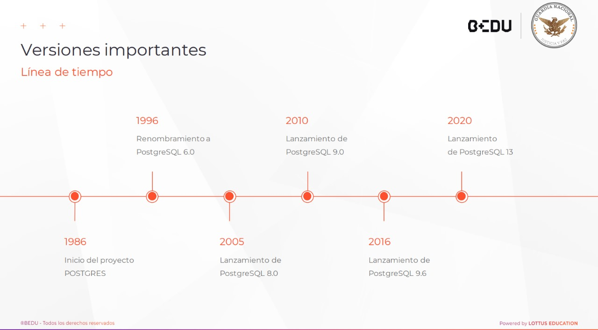

# Proyecto-PostgreSQL-Avanzado
Proyecto PostgreSQL Avanzado

Autor: Jose Manuel Barrientos Quintero

Descripcion 
* 1986: Inicio del proyecto POTGRES
* 1996: Renombramiento a PostgreSQL 6.0
* 2005: Lanzamiento de PostgreSQL 8.0 (soporte nativo para Windows)
* 2010: PostgreSQL 9.0 (replicación streaming, Hot Standby)
* 2016: PostgreSQL 9.6 (mejoras en paralelización de consultas)
* 2020: PostgreSQL 13 (optimización de índices, nuevas características de seguridad)

Caracteristicas

Requisitos Previos
